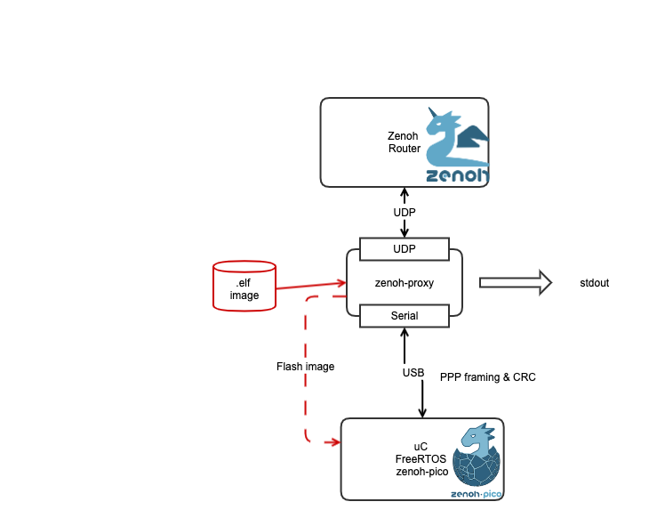

# Zenoh-proxy
Target is to enable small micro-controllers to participate in a [zenoh](http://zenoh.io) network for publishing and subscribing to data
# Approach
A first approach could be to include in the zenoh router the possibility to accept traffic directly from serial ( or I2C, SPI,.. ) lines. 
However dit would create a tight coupling to the specific technology and worst of all I would have to learn yet another language : Rust

The approach taken is that a proxy is running between the serial port and the UDP connection to the router.

The code can start from zenoh-c and zenoh-pico. The zenoh-pico looks like the most straight forward one as it already supports the raw UDP communication link.

So the idea is to mimic the udp interface at the micro-controller side and encapsulate over the serial line to the proxy running on the same machine as the router. 

# Target features 
- No TCP/IP stack or ethernet or wifi required.
- Enable zenoh communication to/from zenoh router
- Keep alignment with new releases of zeno-pico, create a direct code-reuse
- the proxy should support the flashing of the micro-controller ( uC ) directly through the serial line ( esptool implementation in the proxy for the ESP32 [esp-serial-flasher] (https://github.com/espressif/esp-serial-flasher ). This is code that Espressif made available. The same should be true for a number of other uC.
- any data coming from the uC that is not a data frame,should be send to stdout of the proxy. This enables raw logging in the device while debugging and testing. So a single USB link is sufficient
- minimum memory footprint at uC side ( validate with STM32F103 and LM4F120 )
- Flashing command can come through zenoh itself or detect presence of file. 
# Architecture
